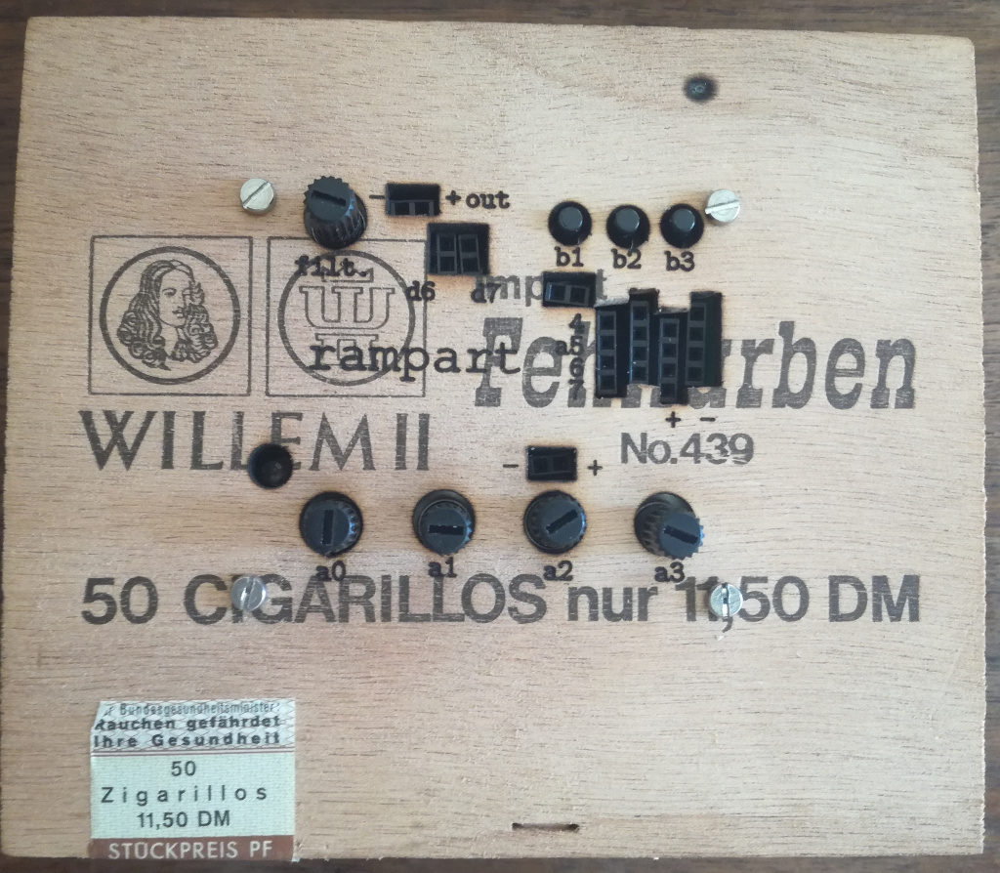

# rampart
An arduino semi-modular synth companion to keep, moat and bastl's kastle.

The prototype uses an Arduino Nano. The Mozzi library is used for synthesis.

Analog Pins 0-3 are potentionmeters. Analog pins 4-7 (4 avaible as an input) are used for modulation signal inputs.

Digital Pin 9 is audio (PWM) out, the Mozzi standard. Digital 2 and 3 and 4 (?) are buttons (2 being used to switch presests currently).

The Fritzing sketch here is still rough as electrical questions (modulate on the pots directly?) are being explored.

A fritzing sketch is included to illustrate the basics.

## Arduino Sketches

A number of Arduino sketches include 2 synths (switch with button 1 on D2) which have 3 to 4 variable parts of the signal. Both sketches share the wavepacket object as 1st synth. One has PDResonant as second, one an FM synth as second synth.

So, Patch 1 is always a wavelet (based on the wavelet example with mozzi) synth and Patch 2 is an FM synth or PDResonant. Also still rough ideas.

This synth works well with Keep (moat), my analog synth and also with Bastl's Kastle synth. I've also played it with Korg's micro modular which works quiet well (in both directions).

I've included a granular synth without mozzi as an example and two versions of a 'glitch synth' from other sources modified to work with rampart.

## Physical inputs

A note on the power input. Currently this should handle 6-12 volts (it's ground and vin). For the moment I've been soldering 'around' the input female J10. This is silly. I'm adding pads for soldering directly.

A note on -/+ out ... these can also be used as input ;) If you take an internal signal (say my moat or a korg micromodular) you can use the filter to simply 'mix' the signals. It's dirty but can be handy.

